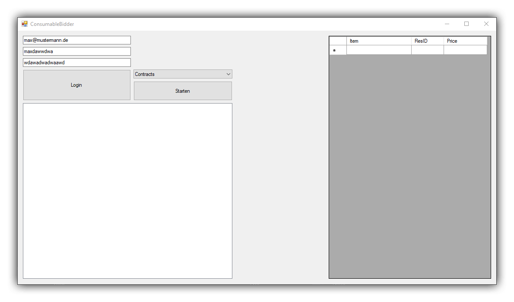

# Fifa14UltimateTeamConsumableBuyer by [igeligel](https://github.com/igeligel)

> This project was developed in 2013-2014 and will not be developed further or
> is gonna work. It is just there to showoff one of the oldest codebases of me.
> Please do not take this code serious!

> Automated trading platform for FIFA 14 Ultimate Team written in C# as Windows
> Forms application with focus on bidding consumables.

## Showcase/Architecture

An ConsumableBuyer for the trading platform of FIFA 14 Ultimate Team written in
2013-2014.

  
<b>In-app screenshots</b>

  

## Dependencies

  
<b>development</b>

| Dependency    | Version |
| ------------- | ------- |
| Visual Studio | > 2017  |
| .NET          | 4.7.1   |

## Installation

Just start the application and give your credentials to the program.

## Contact

## Contributors

<table><thead><tr><th align="center"><a href="https://github.com/igeligel"> igeligel</a> 
Contributions: 2
</th></tbody></table>

## License

_Fifa14UltimateTeamConsumableBuyer_ is realeased under the [MIT License](/LICENSE).
